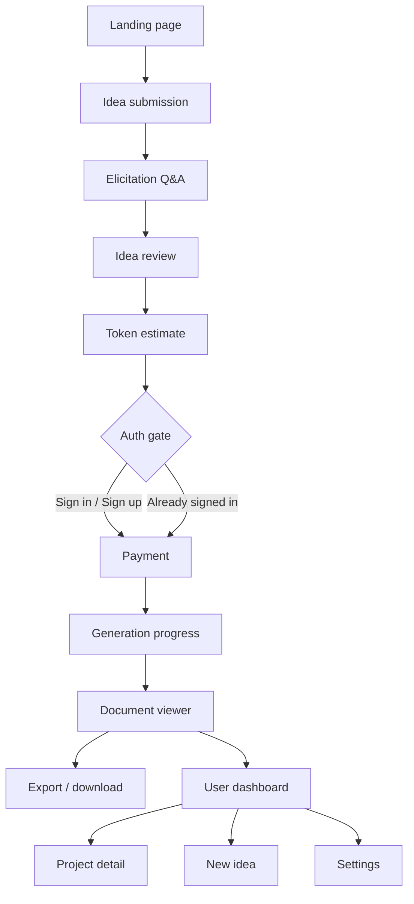
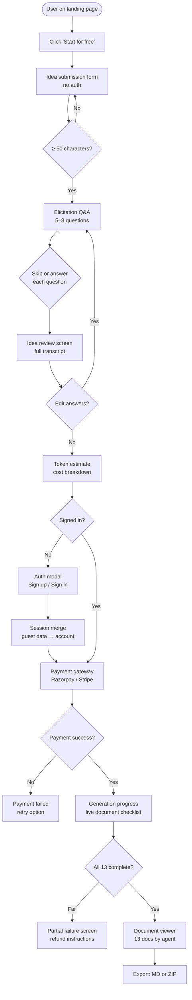
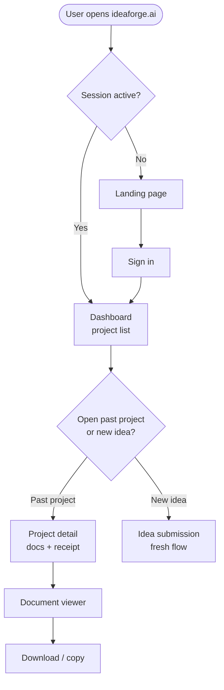
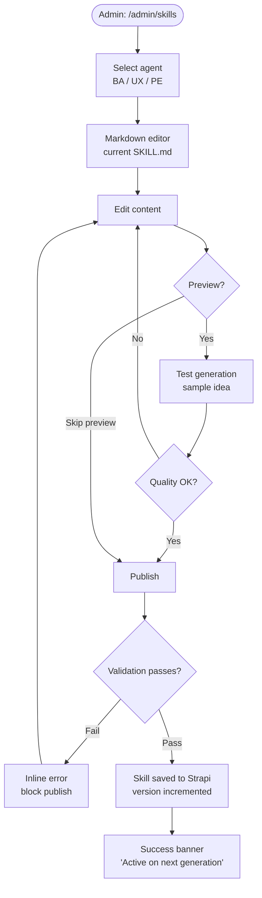

# UI/UX Architecture & Flows
## IdeaForge — AI-Powered SDLC Documentation Platform

| Field | Value |
|---|---|
| Document ID | UIUX-01-IDEAFORGE |
| Version | 1.0 |
| Prepared By | Principal UI/UX Architect |
| Date | June 2026 |
| Traces To | BRD-IDEAFORGE-001 v1.1, FRD-IDEAFORGE-001 v1.1, USR-IDEAFORGE-001 v1.0 |
| Stack | React 18 + Vite + TypeScript · Tailwind CSS · shadcn/ui · Zustand · React Hook Form · Recharts · React Router v6 |
| Design System | Inter (UI) + IBM Plex Mono (IDs/data) · Amber `#BA7517` primary · 0.5px borders · shadcn/ui components |

---

## 1. UX Strategy

### 1.1 Business goals the design serves

IdeaForge monetises per generation. Every UX decision must serve two goals simultaneously: reduce friction on the path from idea to payment (conversion), and make the delivered documents feel so authoritative and complete that users return and refer others (retention).

The single most important conversion moment is the transition from the free elicitation Q&A to the cost estimate screen. The user has invested time answering questions — they are primed to pay. The design must not introduce doubt at this moment. The cost breakdown must feel transparent and fair, not hidden or complex.

The single most important retention moment is the document viewer. If a user opens the BRD and immediately feels it is professional quality — properly structured, cross-referenced, using real BA identifiers — they will pay again and tell others. The viewer must present documents with the same authority as a delivered consulting artefact.

### 1.2 Experience principles

1. **Show value before asking for anything.** The landing page shows a real sample document. The elicitation Q&A runs before sign-up. The cost estimate appears before payment. Users see what they get at every step before committing.
2. **Linear with escape hatches.** The core flow (idea → Q&A → review → estimate → pay → generate → view) is a wizard — users always know where they are and what comes next. But every step allows going back to edit without losing prior work.
3. **Machine precision, human warmth.** The IBM Plex Mono identifiers (BRD-001, FR-042) signal rigour. The conversational elicitation Q&A and plain-language cost breakdown signal approachability. Both must coexist.
4. **Reassurance during the wait.** Generation takes up to 15 minutes. The progress screen is the most emotionally loaded screen in the product — users have paid and are waiting. It must feel active, specific, and trustworthy — not a generic spinner.
5. **Admin is functional, not decorative.** The admin portal is a tool for one technically sophisticated person (Sajan). Density over decoration; data richness over visual complexity.

---

## 2. Personas

### Persona A — Priya, Solo Founder

| Attribute | Detail |
|---|---|
| Role | First-time SaaS founder, non-technical co-founder |
| Context | Works from home on a MacBook; Chrome browser; often starts work in evenings |
| Goals | Wants to hand a developer a clear brief; doesn't know what a BRD or FRD is but knows she needs "documentation" |
| Frustrations | Has been told her ideas are too vague; has wasted money on developers who built the wrong thing |
| Frequency | 1–3 times (one per project or major version) |
| Technical comfort | Low-medium; comfortable with web apps, not with developer tooling |
| Primary device | Desktop / laptop |

### Persona B — Rohan, Freelance Full-Stack Developer

| Attribute | Detail |
|---|---|
| Role | Freelance developer; uses IdeaForge to generate docs before scoping a client project |
| Context | Works on a 27" monitor; uses multiple tabs; highly familiar with developer tooling |
| Goals | Wants the AI dev prompt at the end — that's the killer feature for him; BA docs are a bonus he can hand to clients |
| Frustrations | Clients come to him with no specs; he loses time scoping; he's been burned by scope creep |
| Frequency | 1–2 times per client project; potentially 5–10 times per month |
| Technical comfort | High; will inspect the generated Markdown for quality |
| Primary device | Desktop (large screen) |

### Persona C — Sajan, Platform Admin

| Attribute | Detail |
|---|---|
| Role | Platform owner, sole admin |
| Context | Works from office on Windows laptop; uses the admin panel to monitor revenue, handle disputes, and update agent skills |
| Goals | See revenue and token costs at a glance; update SKILL.md without breaking live generations; resolve payment disputes quickly |
| Frustrations | Doesn't want to dig into code to change pricing or skill content; needs instant visibility when a generation fails |
| Frequency | Daily (analytics); weekly (skill updates); as-needed (disputes) |
| Technical comfort | Very high (CTO) |
| Primary device | Desktop / laptop |

---

## 3. Information Architecture

### 3.1 Application structure

```
IdeaForge
├── Public (no auth required)
│   ├── Landing page            /
│   ├── Idea submission         /idea/new
│   ├── Elicitation Q&A         /idea/:id/elicitation
│   ├── Idea review             /idea/:id/review
│   └── Token estimate          /idea/:id/estimate
│
├── Auth gate                   (modal at estimate → payment step)
│
├── User portal (authenticated)
│   ├── Payment                 /idea/:id/payment
│   ├── Generation progress     /idea/:id/generating
│   ├── Document viewer         /idea/:id/documents
│   ├── Document export         /idea/:id/documents/export
│   ├── Dashboard               /dashboard
│   ├── Project detail          /project/:id
│   └── Settings
│       ├── Profile             /settings/profile
│       ├── Payment history     /settings/payments
│       └── Notifications       /settings/notifications
│
└── Admin portal (admin role only)
    ├── Admin login             /admin/login
    ├── Analytics               /admin/analytics
    ├── Skill manager           /admin/skills
    ├── Pricing config          /admin/pricing
    ├── User management         /admin/users
    └── Dispute resolution      /admin/users/:id/dispute
```

### 3.2 Navigation hierarchy (Mermaid)



### 3.3 Module structure

| Area | Screens | Route pattern |
|---|---|---|
| Public funnel | Landing, Idea submission, Elicitation, Review, Estimate | `/`, `/idea/*` |
| Auth | Sign up, Sign in, Forgot password, Email verification | `/signup`, `/login`, `/forgot-password`, `/verify-email` |
| Core generation | Payment, Progress, Document viewer | `/idea/:id/payment`, `/idea/:id/generating`, `/idea/:id/documents` |
| Project history | Dashboard, Project detail | `/dashboard`, `/project/:id` |
| Settings | Profile, Payments, Notifications | `/settings/*` |
| Admin | Login, Analytics, Skills, Pricing, Users, Disputes | `/admin/*` |

---

## 4. Navigation Patterns

### 4.1 Public funnel — no navigation chrome

Steps 1–5 (landing through estimate) have no sidebar or top navigation. The only persistent element is a minimal top bar with the IdeaForge wordmark and a "Sign in" text link (top right). The funnel is distraction-free — no nav links, no dashboard access. A step progress indicator (5 nodes) is the primary orientation device.

**Rationale:** Every nav link is a potential exit from the conversion funnel. This is standard SaaS practice for free-trial and onboarding flows.

### 4.2 Authenticated user portal — top navigation + contextual sidebar

Once authenticated (post-payment), the shell switches to a persistent top navigation bar with:
- Left: IdeaForge wordmark
- Centre: "Dashboard" · "New idea" links
- Right: Notification bell · User avatar + dropdown (Profile, Settings, Sign out)

No sidebar in the main dashboard or settings — these are simple enough to not need one.

The document viewer (`/idea/:id/documents`) has a dedicated left sidebar listing all 13 documents grouped by agent — this is the only screen with a sidebar, and it is scoped to that screen only.

**Rationale:** The product is not a deep module-heavy enterprise app. A sidebar on every screen would feel heavyweight for a tool that most users interact with linearly. The document viewer is the exception because switching between 13 documents is a navigation problem that a sidebar solves cleanly.

### 4.3 Admin portal — left sidebar navigation

The admin portal uses a persistent left sidebar (240px) with:
- IdeaForge logo + "Admin" badge
- Navigation items: Analytics · Skill manager · Pricing config · Users
- Bottom: Back to platform · Sign out

**Rationale:** Admin is data-dense and multi-module. A sidebar is the standard pattern for this use case and allows fast switching between analytics, skills, and user management without losing context.

### 4.4 Mobile navigation

- Public funnel: single-column layout; step indicator shrinks to pill (e.g. "Step 3 of 5"); top bar collapses to wordmark only
- User portal: top nav collapses to hamburger drawer; document viewer sidebar becomes a bottom sheet triggered by a "Documents" FAB
- Admin portal: sidebar collapses to icon rail on tablet; full drawer on mobile (admin is desktop-primary — mobile is secondary consideration)

---

## 5. User Journey Maps

### 5.1 Priya's journey — first-time founder

| Stage | Action | Screen | Thinks / Feels | Pain points | Design opportunity |
|---|---|---|---|---|---|
| Awareness | Finds IdeaForge via Twitter / Google | Landing page | "Is this real? What does the output actually look like?" | Scepticism about AI quality | Show a real, scrollable BRD sample above the fold |
| Curiosity | Reads sample output, clicks "Start for free" | Landing → Idea form | "No sign-up? OK, I'll try." | Signup walls kill momentum | Guest flow — no auth required |
| Input | Types her app idea, selects industry | Idea submission | "Am I describing it the right way?" | Self-doubt about quality of input | Character count + example hint text |
| Discovery | Answers BA agent questions | Elicitation Q&A | "Oh, it's asking smart questions. This feels like a real consultation." | Anxiety if question is confusing | Skip option; progress indicator "Question 3 of 7" |
| Validation | Reviews her idea and Q&A transcript | Idea review | "I can see what it understood. I trust it more now." | Fear of paying for wrong output | Edit answers link; clear summary |
| Commitment | Sees cost breakdown | Token estimate | "₹399 — that's less than a coffee meeting with a consultant." | Confusion about what the number means | Transparent breakdown; "what you get" checklist |
| Friction | Asked to sign up | Auth modal | "Ugh, another account." | Signup fatigue | Contextual framing: "One account to receive your docs and payment receipt" |
| Trust | Completes Razorpay payment | Payment | "UPI is so much easier." | Payment anxiety | UPI as first option; trust badges |
| Wait | Watches generation progress | Progress screen | "It's actually doing something specific — I can see 'Generating: User Stories'" | 15-minute wait anxiety | Named document progress; estimated time |
| Delight | Opens BRD | Document viewer | "This looks like something a real BA wrote." | Anti-climax if formatting is poor | Professional Markdown rendering; real BA identifiers |
| Action | Downloads ZIP | Export | "I'm going to send this to my developer." | Can't find download button | Prominent export CTA in viewer header |

### 5.2 Rohan's journey — freelance developer

| Stage | Action | Screen | Thinks / Feels | Pain points | Design opportunity |
|---|---|---|---|---|---|
| Need | New client with vague brief | — | "I need docs before I can quote." | Client has no requirements | IdeaForge is the solution |
| Speed | Goes straight to idea form | Idea submission | "I know what I'm doing — get out of my way." | Slow onboarding | No tutorial forced; fast path to Q&A |
| Efficiency | Answers Q&A briskly | Elicitation | "Good questions. This will save me 4 hours of discovery." | Questions that feel generic | Industry-specific questions (informed by persona role) |
| Scan | Skims estimate | Token estimate | "₹399 for 13 docs — client will pay for this." | — | Invoice-ready receipt email |
| Skip | Already signed in from last project | Auth gate | "Straight to payment." | — | Remembered session; no re-auth |
| Priority | First thing: opens Dev Prompt tab | Document viewer | "This is the reason I use this." | Dev prompt is buried on tab 3 | Pin Dev Prompt as a featured tab |
| Copy | Pastes into Cursor | Export / copy | "Let's see if it scaffolds properly." | Poor prompt structure | Structured prompt with module breakdowns |

---

## 6. User Flows

### 6.1 Core generation flow (happy path)



### 6.2 Returning user flow



### 6.3 Admin skill update flow



---

## 7. Wireframe Sketches (Low-fidelity)

### 7.1 Landing page

```
┌─────────────────────────────────────────────────────┐
│ [IdeaForge wordmark]                    [Sign in]   │  ← Minimal top bar
├─────────────────────────────────────────────────────┤
│                                                     │
│   From idea to 13 SDLC documents                   │  ← Hero — one line
│   in under 15 minutes.                             │
│                                                     │
│   [Start for free — no sign-up]                    │  ← Primary CTA
│                                                     │
│   ─────── Sample output ───────                    │
│   ┌─────────────────────────────┐                  │
│   │ BRD · Business Requirements │  ← Real doc      │
│   │ [scrollable preview]        │    preview card  │
│   └─────────────────────────────┘                  │
│                                                     │
│   How it works                                     │
│   [1 Idea] → [2 Q&A] → [3 Pay] → [4 Docs]        │  ← 4-step strip
│                                                     │
│   What you get                                     │
│   [BRD] [FRD] [SRS] [BMP] [USR] [PFD]            │  ← Doc tag cloud
│   [UC] [DMD] [UAT] [RTM] [UI/UX] [DEV PROMPT]    │
│                                                     │
│   Starts from ₹199 per generation                  │
└─────────────────────────────────────────────────────┘
```

### 7.2 Idea submission

```
┌─────────────────────────────────────────────────────┐
│ [IdeaForge]                            [Sign in]    │
├─────────────────────────────────────────────────────┤
│  ● ○ ○ ○ ○   Step 1 of 5                          │  ← Step indicator
│                                                     │
│  Describe your application idea                    │
│  ┌─────────────────────────────────────────────┐   │
│  │ [textarea — min 50, max 2000 chars]         │   │
│  │                                             │   │
│  │                                             │   │
│  └─────────────────────────────────────────────┘   │
│  0 / 2000 · min 50                                 │
│                                                     │
│  Industry [dropdown]    Tech preference [dropdown]  │
│                                                     │
│  [Start elicitation →]  ← disabled until min 50   │
│                                                     │
│  Your progress is saved in this browser session    │  ← Guest notice
└─────────────────────────────────────────────────────┘
```

### 7.3 Elicitation Q&A

```
┌─────────────────────────────────────────────────────┐
│ [IdeaForge]                            [Sign in]    │
├─────────────────────────────────────────────────────┤
│  ● ● ○ ○ ○   Step 2 of 5   Question 3 of 7        │
│                                                     │
│  ┌──────────────────────────────────────────────┐  │
│  │ BA Agent                                     │  │  ← Agent message
│  │ "Who are the primary users of this app —     │  │
│  │  will they be technical or non-technical?"   │  │
│  └──────────────────────────────────────────────┘  │
│                                                     │
│  ┌──────────────────────────────────────────────┐  │
│  │ Your previous answers ↑ (collapsed)          │  │
│  └──────────────────────────────────────────────┘  │
│                                                     │
│  ┌──────────────────────────────────────────────┐  │
│  │ [Your answer — textarea]                     │  │  ← User input
│  └──────────────────────────────────────────────┘  │
│  [Answer →]              [Skip this question]       │
└─────────────────────────────────────────────────────┘
```

### 7.4 Token estimate & cost breakdown

```
┌─────────────────────────────────────────────────────┐
│ [IdeaForge]                            [Sign in]    │
├─────────────────────────────────────────────────────┤
│  ● ● ● ● ○   Step 4 of 5                          │
│                                                     │
│  Your generation estimate                          │
│                                                     │
│  ┌──────────────────────────────────────────────┐  │
│  │ Model: Claude Sonnet 4.6                     │  │
│  │ Est. tokens: 284,000 (incl. 1.4× buffer)    │  │
│  │                                              │  │
│  │ Anthropic API cost    ₹ 82.00               │  │
│  │ Platform fee          ₹ 82.00               │  │
│  │ GST (18%)             ₹ 29.52               │  │
│  │ ─────────────────────────────               │  │
│  │ Total                 ₹ 193.52              │  │
│  └──────────────────────────────────────────────┘  │
│                                                     │
│  What you'll receive:                              │
│  [BRD][FRD][SRS][BMP][USR][PFD][UC][DMD]          │
│  [UAT][RTM][UI/UX][DEV PROMPT][ELICITATION]        │
│                                                     │
│  [Pay ₹193.52 & generate documents]                │  ← Primary CTA
│  [← Back to review]                                │
└─────────────────────────────────────────────────────┘
```

### 7.5 Generation progress screen

```
┌─────────────────────────────────────────────────────┐
│ [IdeaForge]                          [User ▾]       │
├─────────────────────────────────────────────────────┤
│                                                     │
│  Generating your documents                         │
│  PRJ-00143 · Clinic management SaaS               │
│                                                     │
│  [BA Agent ●] ──────── [UX Agent ○] ─── [PE ○]   │  ← Agent pipeline
│                                                     │
│  ┌──────────────────────────────────────────────┐  │
│  │ ✓ BRD — Business Requirements Doc           │  │
│  │ ✓ FRD — Functional Requirements             │  │
│  │ ✓ SRS — System Requirements Spec            │  │
│  │ ⟳ BMP — Benefit Measurement Plan  ← active │  │
│  │ ○ USR — User Stories                        │  │
│  │ ○ PFD — Process Flow Diagrams               │  │
│  │ ○ UC  — Use Cases                           │  │
│  │ ○ DMD — Data Mapping                        │  │
│  │ ○ UAT — User Acceptance Testing             │  │
│  │ ○ RTM — Requirements Traceability           │  │
│  │ ○ UI/UX — Design Specification              │  │
│  │ ○ DEV PROMPT — AI Dev Prompt                │  │
│  │ ○ ELICITATION — Q&A Transcript              │  │
│  └──────────────────────────────────────────────┘  │
│                                                     │
│  Estimated time remaining: ~9 minutes              │
│  [████████░░░░░░░░░░] 4 / 13                       │
└─────────────────────────────────────────────────────┘
```

### 7.6 Document viewer

```
┌─────────────────────────────────────────────────────┐
│ [IdeaForge]  Dashboard  New idea        [User ▾]    │
├──────────────┬──────────────────────────────────────┤
│ BA Agent(10) │ [BRD] Business Requirements Doc      │
│  ✓ BRD      │ PRJ-00143 · BRD-001                  │
│  ✓ FRD      │                          [Copy][↓ MD] │
│  ✓ SRS      ├──────────────────────────────────────┤
│  ✓ BMP      │                                      │
│  ✓ USR      │  # Business Requirements Document    │
│  ✓ PFD      │  ## IdeaForge...                     │
│  ✓ UC       │                                      │
│  ✓ DMD      │  [rendered Markdown]                 │
│  ✓ UAT      │                                      │
│  ✓ RTM      │                                      │
│─────────────│                                      │
│ UX Agent(1) │                                      │
│  ✓ UI/UX    │                                      │
│─────────────│                                      │
│ PE (1)      │                                      │
│  ✓ Dev Prompt│                                     │
│─────────────│                                      │
│ [↓ Export   │                                      │
│    all ZIP] │                                      │
└──────────────┴──────────────────────────────────────┘
```

### 7.7 Admin analytics dashboard

```
┌────────┬────────────────────────────────────────────┐
│ ≡ Admin│ Analytics                                  │
│        ├────────────────────────────────────────────┤
│ Analytics│ [247]         [₹18.4k]  [284K]  [31%]  │
│ Skills │  Generations   Revenue   Avg tokens Conv. │
│ Pricing│                                            │
│ Users  ├────────────────────────────────────────────┤
│        │ Daily generations (last 30 days)           │
│        │ [Recharts line chart]                      │
│        ├──────────────┬─────────────────────────────┤
│        │ Model usage  │ Top industries              │
│        │ [Pie chart]  │ [Bar chart]                 │
│        ├──────────────┴─────────────────────────────┤
│        │ Recent generations                         │
│        │ [Table: idea snippet · user · amount ·    │
│        │  tokens · status · date]                  │
│        │                                            │
│ ───    │                                            │
│ ← Platform                                         │
│ Sign out                                           │
└────────┴────────────────────────────────────────────┘
```
